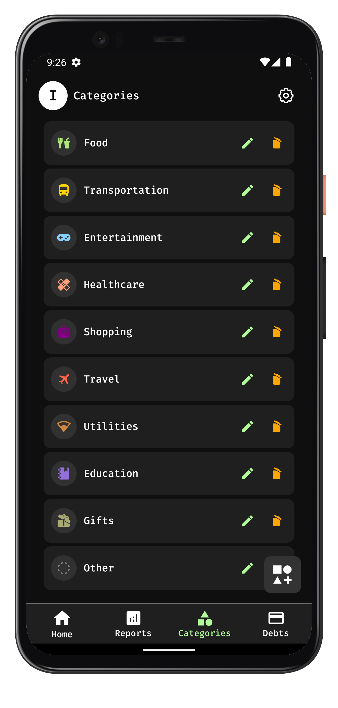
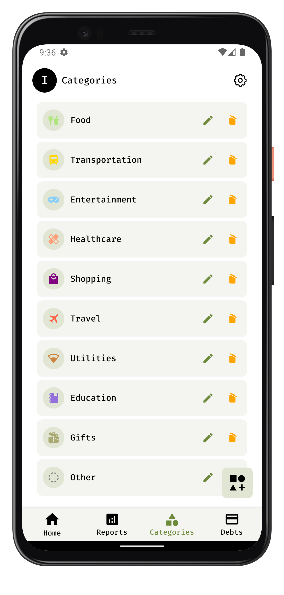

# Personal Finance Tracker

Personal Finance Tracker is a user-centric mobile application designed to help individuals track their expenses, manage their finances, and gain meaningful insights into their spending habits. The app offers customization, robust data management, and detailed reporting to make financial management simple and effective.

---
## Mobile View

Here is a screenshot from the mobile version of the app:
<p align="center">
  
  
</p>


---

## Features

### 1. **User Data Management**
- Securely manage user data, ensuring privacy and reliability.

### 2. **Customizable User Data**
- Tailor user information to suit individual preferences.

### 3. **CRUD Transactions**
- Add, edit, update, or delete financial transactions with ease.

### 4. **Monthly Budget Goals**
- Set and monitor monthly budget goals for effective financial planning.

### 5. **Spending Summary Insights**
- Visualize spending patterns through summary insights and analytics.

### 6. **Custom Categories with Icons**
- Create and manage categories, selecting from a range of icons for visual clarity.

### 7. **Debt Management**
- Keep track of borrowings and lendings with a dedicated debt management feature.

### 8. **Reports**
- Generate daily or monthly financial reports for comprehensive insights.

### 9. **Dark/Light Mode Support**
- Switch between light and dark themes to suit user preferences.

### 10. **Currency Customization**
- Choose an appropriate currency to match your regional or personal requirements.

### 11. **User Customization**
- **Themes**: Seamlessly switch between light and dark themes.
- **Settings**: Personalize settings, including:
  - Currency symbols
  - Username changes
  - Category names
- **Categories**: Create and manage custom categories for more personalized tracking.

---

## Tech Stack

The application leverages modern tools and frameworks for efficient development and smooth performance:

- **React Native**: Core framework for building the application.
- **Realm**: Lightweight and secure database for local storage.
- **Redux Toolkit**: Simplified state management with powerful tools.
- **Redux-Saga**: Manages application side-effects effectively.
- **Zod**: Ensures data validation and structure integrity.

---

## Getting Started

Follow these steps to set up and run the project locally:

### Prerequisites
1. Ensure you have **Node.js** installed on your machine. Download it [here](https://nodejs.org/).
2. Set up your development environment for **React Native**:
   - Android Studio (for Android development)
   - Xcode (for iOS development)

### Installation

1. Clone the repository:

   ```bash
   git clone https://github.com/NevilPatel01/personal-finance-tracker.git
   ```

2. Navigate to the project directory:

   ```bash
   cd personal-finance-tracker
   ```

3. Install the required dependencies:

   ```bash
   npm install
   ```
   **or**
   ```bash
   yarn install
   ```

4. Start the app:

   - For Android:
     ```bash
     npx react-native run-android
     ```
   - For iOS:
     ```bash
     npx react-native run-ios
     ```

### Development Tips
- Use `npm start` or `yarn start` to launch the Metro Bundler.
- Connect a physical device or use an emulator to test the application.

---

## Contribution

Contributions are welcome! To contribute to the project:

1. Fork the repository.
2. Create a new branch:
   ```bash
   git checkout -b feature-name
   ```
3. Commit your changes:
   ```bash
   git commit -m "Add feature description"
   ```
4. Push the branch:
   ```bash
   git push origin feature-name
   ```
5. Open a pull request.

---

Start tracking your finances today with **Personal Finance Tracker** and take control of your financial future!
